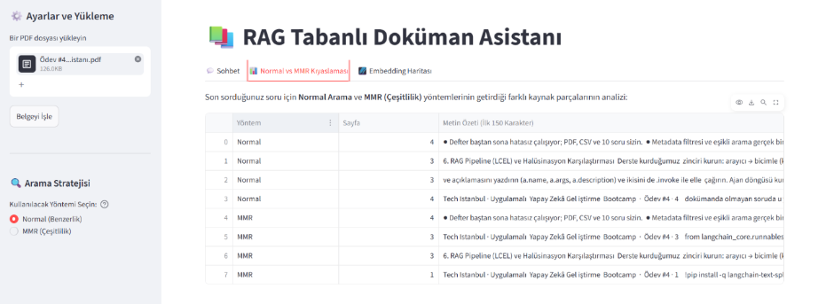

# 📄 RAG Tabanlı Yapay Zeka Doküman Asistanı

Geleneksel doküman inceleme süreçleri, uzun ve karmaşık metinler (hukuki sözleşmeler, teknik raporlar, akademik makaleler) söz konusu olduğunda yetersiz kalmaktadır. Standart anahtar kelime aramaları (Ctrl+F) bağlamı anlayamazken, genel Büyük Dil Modelleri (LLM) dışarıdan belge beslenmediğinde halüsinasyon (bilgi uydurma) riski taşır.

Bu proje, **Retrieval-Augmented Generation (RAG)** mimarisini kullanarak bu sorunları çözer. Sistem, yüklenen belgeleri vektörel uzayda analiz eder, kullanıcının sorularını semantik (anlamsal) olarak eşleştirir ve **yalnızca** belge içindeki verileri kullanarak halüsinasyonsuz, kaynak sayfa belirten, güvenilir yanıtlar üretir.

## 🚀 Temel Özellikler ve Çözülen Sorunlar

- **Bağlamsal ve Doğrulanabilir Yanıtlar:** Sistem, genel geçer bilgiler uydurmak yerine, doğrudan yüklenen PDF belgesindeki bilgileri çeker ve yanıtın sonuna kaynak sayfayı ekler[cite: 24, 25]. Bilgi belgede yoksa "Sağlanan belgelerde bu bilgi bulunmamaktadır" diyerek güvenilirliği korur[cite: 24].
- **Arama Stratejisi Kontrolü (Standard vs. MMR):** Kullanıcı ihtiyacına göre arama algoritması değiştirilebilir. "Normal Arama" doğrudan matematiksel benzerliğe odaklanırken; "MMR (Çeşitlilik) Araması", belgenin farklı bölümlerindeki (Örn: Sayfa 1, 3 ve 4) bilgileri toparlayarak geniş açılı özetler sunar. Arka plandaki bu ayrım, şeffaf bir analiz tablosuyla kullanıcıya gösterilir.
- **Görsel Semantik Analiz (PCA Uzayı):** Yüklenen belgedeki metin parçalarının (chunk) 384 boyutlu vektörleri, Temel Bileşen Analizi (PCA) ile 2 boyuta düşürülerek görselleştirilir. Bu sayede belgedeki hangi sayfaların anlamsal olarak birbirine yakın olduğu interaktif bir harita üzerinde incelenebilir.

## 📸 Ekran Görüntüleri

_Kullanıcı Dostu Sohbet Arayüzü ve Doğrudan Bilgi Çekimi:_
>)

_Mantıksal Çıkarım ve Halüsinasyon Önleme Testi:_
)

_Arama Stratejilerinin (Normal vs MMR) Arka Plan Analizi:_
![MMR Analizi]

_Doküman Semantik Vektör Haritası (PCA Uzayı):_
)

## 🛠️ Teknolojiler

- **Kullanıcı Arayüzü:** Streamlit
- **Orkestrasyon & RAG Mimarisi:** LangChain, LangChain-Classic
- **LLM & Embedding:** Google Gemini (`gemini-3.8-flash`)
- **Veri Analizi & Görselleştirme:** Scikit-learn (PCA), Pandas, Plotly
- **Loglama:** SQLite (Trace log mimarisi)

## 🛤️ Yol Haritası (Gelecek Geliştirmeler)

Bu proje sürekli olarak geliştirilmektedir. İlerleyen güncellemelerde (commit'lerde) eklenecek özellikler:

- [ ] **Sohbet Geçmişi (Conversational Memory):** Asistanın önceki soruları hatırlayarak bağlamsal sohbeti sürdürebilmesi.
- [ ] **Çoklu Doküman İşleme:** Birden fazla PDF'in aynı anda yüklenip çapraz analiz yapılabilmesi.
- [ ] **Kalıcı Vektör Veritabanı:** Geçici bellek yerine ChromaDB veya Pinecone entegrasyonu ile büyük ölçekli arşiv taraması.
- [ ] **Hibrit Arama (Hybrid Search):** Vektörel arama ile BM25 anahtar kelime aramasının birleştirilmesi.
